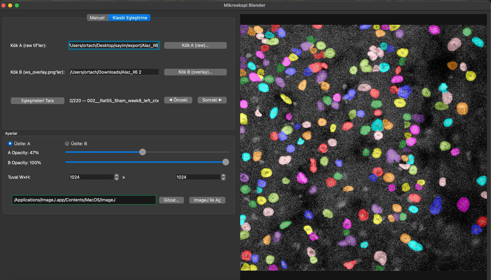

# Microscopy Image Blender

A PySide6-based GUI application for blending and visualizing microscopy images.

## Screenshots

<p align="center">
  
</p>

<p align="center">
  
</p>

## Features

- **Dual-Layer Image Blending**: Overlay two images (PNG, JPG, TIFF) with alpha compositing
- **Opacity Control**: Independent transparency adjustment for each layer
- **Batch Processing**: Quickly navigate through multiple image pairs with folder matching
- **ImageJ Integration**: Open blended images directly in ImageJ/Fiji
- **Save Results**: Export results in PNG or TIFF format
- **Keyboard Shortcuts**: Navigate between images using left/right arrow keys

## Requirements

```bash
pip install numpy tifffile scikit-image PySide6
